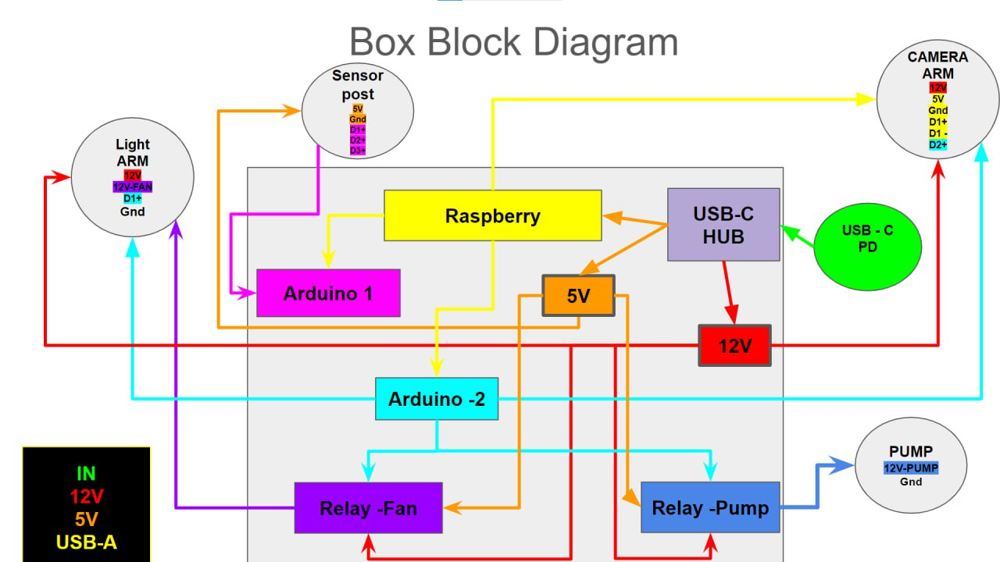
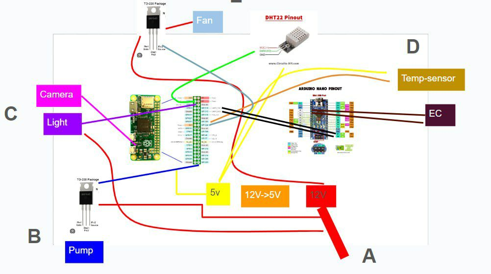
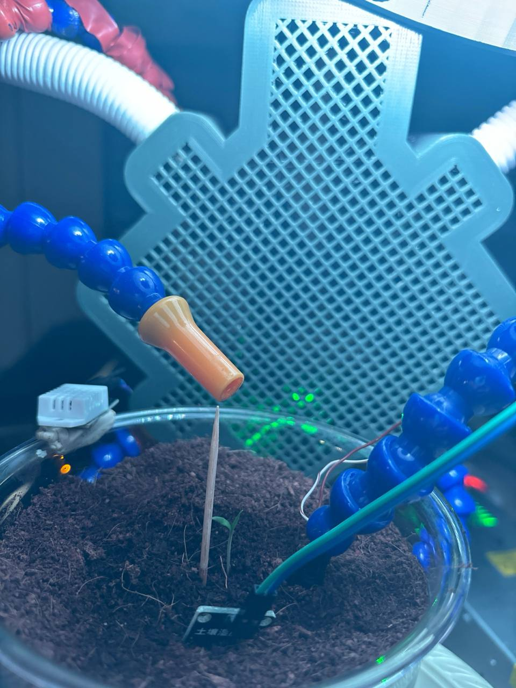

# 🌱 Cloud Gardener – Smart Autonomous Plant Care System

Cloud Gardener is a personal IoT/embedded project designed to autonomously monitor and maintain the health of plants using real-time sensor data, environmental feedback, and automated control.  
It integrates Raspberry Pi, Arduino, C/C++, Python, sensors, and actuators into one cohesive system.

---

## 🧠 What It Does

- 🌡️ Reads environmental and soil data: temperature, humidity, electrical conductivity, light (RGB), UV, fan/pump status.
- 💡 Manages actuators (pump, light, fans) on a schedule or based on thresholds.
- 📸 Periodically captures images using a USB camera with day/night flash logic.
- 🧾 Logs all sensor data to daily CSV files.
- 🔄 Restores actuator states between reboots.
- 📡 Communicates with Arduino over serial using validated commands.

---

## 🧰 Technologies Used

| Component   | Tech                                                               |
|------------|--------------------------------------------------------------------|
| Hardware   | Raspberry Pi, Arduino UNO, DHT Sensor, UV Sensor, EC Probe, Pump, Relay, USB Camera |
| Languages  | Python, C, C++, Arduino (C-like)                                   |
| Communication | Serial (PySerial), Bash scripts                                 |
| Libraries  | OpenCV, V4L2, Pandas, APScheduler                                  |
| OS         | Linux (Raspberry Pi OS)                                            |

---

## 🗂️ Key Files

| File                    | Description                                             |
|-------------------------|---------------------------------------------------------|
| `Main.py`              | Central scheduler that initializes and runs periodic tasks |
| `Extract_Data.py`      | Reads and logs sensor data from Arduino                 |
| `Script_Executer.py`   | Sends validated commands to Arduino; manages logic flow |
| `Arduino_commands.py`  | Resets Arduino over serial                              |
| `Camera.py`, `Camera_using_C.py` | Captures images using Python or low-level C  |
| `capture_image.c/.cpp` | Standalone camera capture tools (V4L2 / OpenCV based)   |
| `Arduino_V3_0.ino`     | Arduino sketch to read sensors & activate actuators     |
| `Pre_Installation.sh`  | Installs Python packages                                |
| `C_requirements.sh`    | Installs dependencies for C camera tools                |
| `requirements.txt`     | Python libraries list                                   |

---

## 📁 Folder Structure

```bash
cloud-gardener-demo/
├── Main.py
├── Extract_Data.py
├── Script_Executer.py
├── Arduino_commands.py
├── Camera.py
├── Camera_using_C.py
├── capture_image.c / .cpp
├── Arduino_V3_0.ino
├── Pre_Installation.sh
├── C_requirements.sh
├── requirements.txt
├── Pics&Data/
│   ├── YYYY-MM-DD.csv
│   └── cameraA/ cameraB/
├── working_plan/
│   └── working_plan.json
```

---

## 🚀 How to Run

### 🔧 Installation

```bash
chmod +x Pre_Installation.sh C_requirements.sh
./Pre_Installation.sh
./C_requirements.sh
```

Make sure your Arduino and USB camera are connected.

---

### ▶️ Start the system

```bash
python3 Main.py
```

The scheduler will:
- Capture sensor data every minute
- Log it to CSV
- Control pumps/fans/lights automatically
- Take photos every 10 minutes (flash optional)

---

## 📈 Example Use-Cases

- Home garden automation
- Research greenhouse data collection
- Educational demo for hardware/software integration

---


## 📸 System Media

### ▶️ Setup Video  
[](Media/Setup.mp4)

### Structure Overview  


### Zoomed In  


---

## 👤 Author

**Yair Laniado**  
B.Sc. in Electrical Engineering & Applied Physics – Hebrew University of Jerusalem  
🔗 [GitHub](https://github.com/YairLani1)  
📧 laniadoyair@gmail.com  

> _This public version includes demo components only. Sensitive files and full datasets are intentionally excluded._
